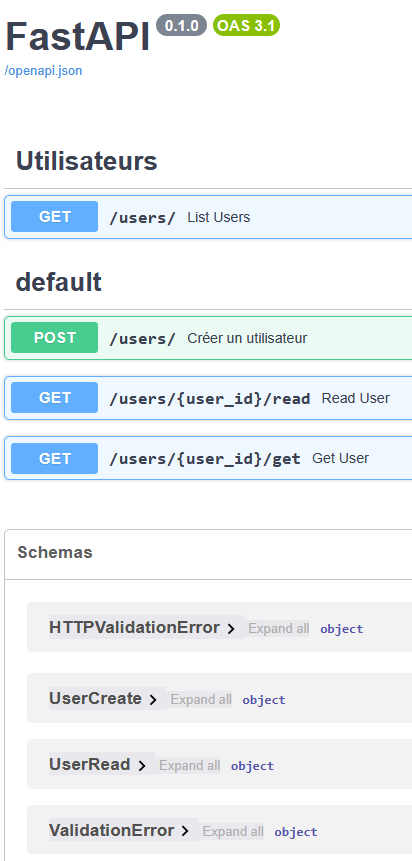
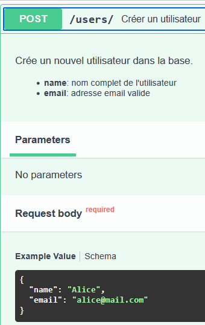
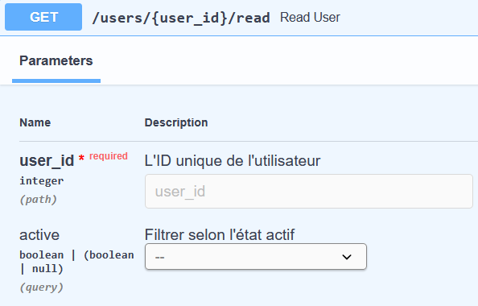
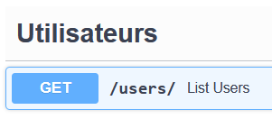
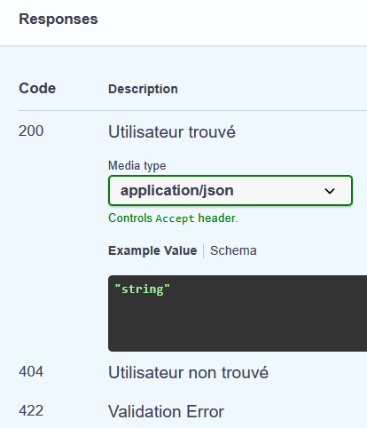

<br>

# **Documentation automatique avec FastAPI**

<br>

## **<u>Sommaire</u>**

- [**Documentation automatique avec FastAPI**](#documentation-automatique-avec-fastapi)
  - [**Sommaire**](#sommaire)
  - [**1. Documentation générée grâce aux schémas Pydantic**](#1-documentation-générée-grâce-aux-schémas-pydantic)
  - [**2. Interfaces graphiques disponibles**](#2-interfaces-graphiques-disponibles)
  - [**3. Exemple d’annotation d’un endpoint**](#3-exemple-dannotation-dun-endpoint)
  - [**4. Autres options de documentation**](#4-autres-options-de-documentation)
  - [**5. Résumé**](#5-résumé)

<div style="page-break-after: always;"></div>

## **<u>1. Documentation générée grâce aux schémas Pydantic</u>**

FastAPI utilise les modèles Pydantic (comme `UserCreate`, `UserRead`, etc.) pour :

* **Générer automatiquement la structure des données attendues en entrée** (exemple : corps JSON)
* **Afficher les formats des données retournées** (réponses)
* **Valider les données envoyées par le client** selon ces schémas

Cela permet d’avoir une documentation précise, toujours à jour et cohérente avec le code.

<br>

## **<u>2. Interfaces graphiques disponibles</u>**

FastAPI génère deux interfaces interactives pour tester et documenter l’API :

| Interface  | URL par défaut | Description                                                                                  |
| ---------- | -------------- | -------------------------------------------------------------------------------------------- |
| Swagger UI | `/docs`        | Documentation interactive et visuelle très complète, avec possibilité de tester les requêtes |
| ReDoc      | `/redoc`       | Documentation plus détaillée, orientée lecture et compréhension                              |

Représentation visuelle :

|  |  |
| ------------------------------ | -------------------------- |
| docs                           | redoc                      |

<div style="page-break-after: always;"></div>

## **<u>3. Exemple d’annotation d’un endpoint</u>**

```python
from fastapi import FastAPI, Path, Query, Body

app = FastAPI()

@app.post(
    "/users/",
    response_model=UserRead,
    summary="Créer un utilisateur"
)
def create_user(
    user:UserCreate=Body(..., example={"name":"Alice", "email":"alice@mail.com"})
):
    """
    Crée un nouvel utilisateur dans la base.

    - **name**: nom complet de l'utilisateur
    - **email**: adresse email valide
    """
    # logique de création ici...
    return user  # Exemple simplifié
```

* `response_model=UserRead` : indique le schéma attendu en réponse (sert à générer la doc et la validation)
* `summary` : résumé affiché dans Swagger UI
* `Body(..., example=...)` : exemple concret affiché dans la doc, aide à comprendre le format attendu
* La docstring de la fonction est utilisée comme description détaillée visible dans Swagger UI



<br>

## **<u>4. Autres options de documentation</u>**

* **Descriptions sur les paramètres** : on peut ajouter des descriptions dans les paramètres `Path`, `Query`, ou `Body` :

```python
@app.get("/users/{user_id}")
def read_user(
    user_id: int = Path(..., description="L'ID unique de l'utilisateur"),
    active: bool | None = Query(None, description="Filtrer selon l'état actif")
):
    ...
```



* **Tags** : regrouper les endpoints par catégories dans la doc

```python
app = FastAPI()

@app.get("/users/", tags=["Utilisateurs"])
def list_users():
    ...
```



* **Réponses personnalisées** : on peut documenter les codes HTTP attendus

```python
from fastapi.responses import JSONResponse
from fastapi import status

@app.get(
    "/users/{user_id}",
    responses={
        404: {"description": "Utilisateur non trouvé"},
        200: {"description": "Utilisateur trouvé"}
    }
)
def get_user(user_id: int):
    ...
```



<br>

## **<u>5. Résumé</u>**

Grâce aux schémas Pydantic et aux annotations sur les endpoints, FastAPI produit une documentation :

* **automatique, précise et interactive**
* **facile à maintenir** (car directement liée au code)
* **accessible aux développeurs et consommateurs d’API**