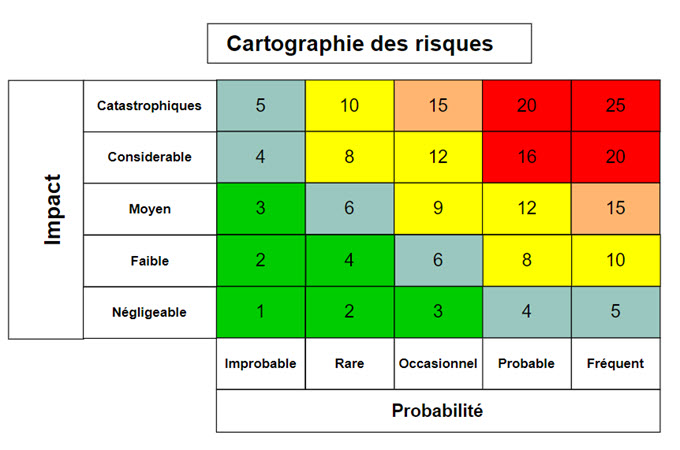

 

# **Pourquoi écrire des tests ?**

 

## <u>**Sommaire**</u>

- [Pourquoi écrire des tests ?](#pourquoi-écrire-des-tests-)
  - [Comprendre l’importance des tests automatisés](#comprendre-limportance-des-tests-automatisés)
  - [Avantages des tests automatisés](#avantages-des-tests-automatisés)
  - [Et sans tests ?](#et-sans-tests-)
  - [Exemple réel : Ariane 5](#exemple-réel--ariane-5)
  - [Pourquoi les tests facilitent le changement ?](#pourquoi-les-tests-facilitent-le-changement-)
  - [Dette technique et gestion des risques](#dette-technique-et-gestion-des-risques)
  - [Conclusion](#conclusion)

## **🧠 <u>Comprendre l’importance des tests automatisés</u>**

Construiriez-vous une maison sans vérifier que les fondations sont solides ? Les tests sont à nos applications ce que les contrôles de qualité sont à l’ingénierie : une garantie que chaque pièce fonctionne correctement, aujourd’hui comme demain.

Les tests automatisés ne sont pas une perte de temps. Ils sont une **assurance** contre les bugs, une **documentation vivante** du comportement attendu et un **levier de confiance** pour toute l’équipe projet.

> Les tests sont les gardiens de la robustesse de nos projets, et ils rendent les développeurs sereins lors des évolutions du code.

 

## **✅ <u>Avantages des tests automatisés</u>**

* **Détection précoce des bugs**
  → Identifier les erreurs avant qu'elles n'atteignent la production.

* **Gain de temps à long terme**
  → Moins de tests manuels, moins de retours utilisateurs à gérer, moins de patchs en urgence.

* **Documentent le comportement attendu**
  → Les tests expliquent *comment* le code doit se comporter, sans commentaire inutile.

* **Facilitent la refactorisation**
  → Changer le code sans crainte de tout casser, grâce à des filets de sécurité automatisés.

* **Favorisent la collaboration**
  → Les nouveaux développeurs peuvent comprendre rapidement ce que fait le code en lisant les tests
  
 

## **⚠️ <u>Et sans tests ?</u>**

* Bugs silencieux, comportements non maîtrisés
* Régressions lors des modifications
* Difficultés à maintenir et faire évoluer le projet
* Tension entre développeurs et utilisateurs finaux

## **💡 <u>Exemple réel : Ariane 5</u>**

Le 4 juin 1996, la fusée Ariane 5 explose 37 secondes après son lancement. La cause ? Un **simple dépassement d'entier** dans le logiciel de guidage.

Une variable de vitesse codée sur 8 bits a dépassé 255, provoquant un retour à 0, puis une cascade d’erreurs non gérées.

> Ce bug aurait pu être détecté **avec un simple test unitaire**.

 

## **🧱 <u>Pourquoi les tests facilitent le changement ?</u>**

Tout projet logiciel évolue : ajout de fonctionnalités, corrections, amélioration des performances… mais à chaque modification, le risque de casser l’existant est réel.

Les tests de **non-régression** permettent de s'assurer que ce qui fonctionnait avant fonctionne toujours après un changement.

## **💸 <u>Dette technique et gestion des risques</u>**

* **Dette technique :** quand on repousse la qualité à plus tard, on accumule des failles. Les tests permettent de contenir cette dette.

* **Définir le risque :**
  `Risque = Impact × Probabilité`

Exemple :

* Une météorite frappe le datacenter (Impact élevé, Probabilité faible)
* Un développeur supprime une route par erreur (Impact modéré, Probabilité élevée)

Avec des tests, le deuxième risque peut être anticipé, détecté, corrigé.

 

## **🛠️ <u>Conclusion</u>**

Les tests sont des outils concrets pour améliorer :

* la **qualité** du code
* la **sérénité** des développeurs
* la **fiabilité** des livrables
* et la **confiance** des utilisateurs

Ils ne sont pas une charge, mais un **investissement durable** dans la réussite d’un projet.
